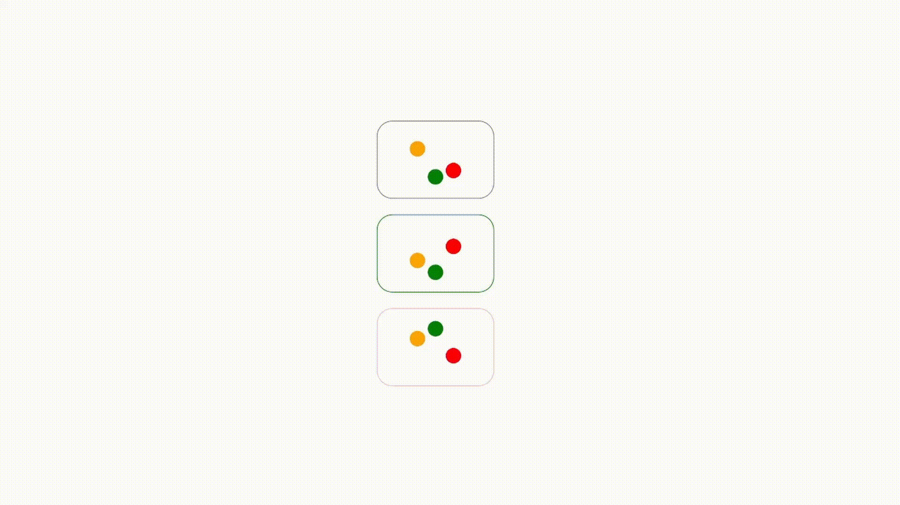

# Animation Samples in QtQuick/QML
Hi there, this is just my free time animation samples for different ideas implemented in Qt's QtQuick/QML for desktop/mobile/web. 


## Bounce Animation (3 Balls)
Used as loading indicators when feching requests, processing inputs, etc. 
  
  ### Usage
  ```js
    BounceAnimation {
        running: true
        duration: 500
    }
  ```  


  

# Contributing
Feel free to send in pull requests for new ideas/code/bug fixes
 
